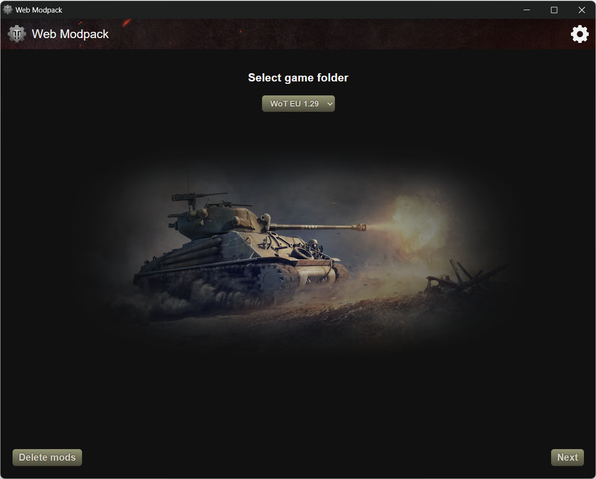
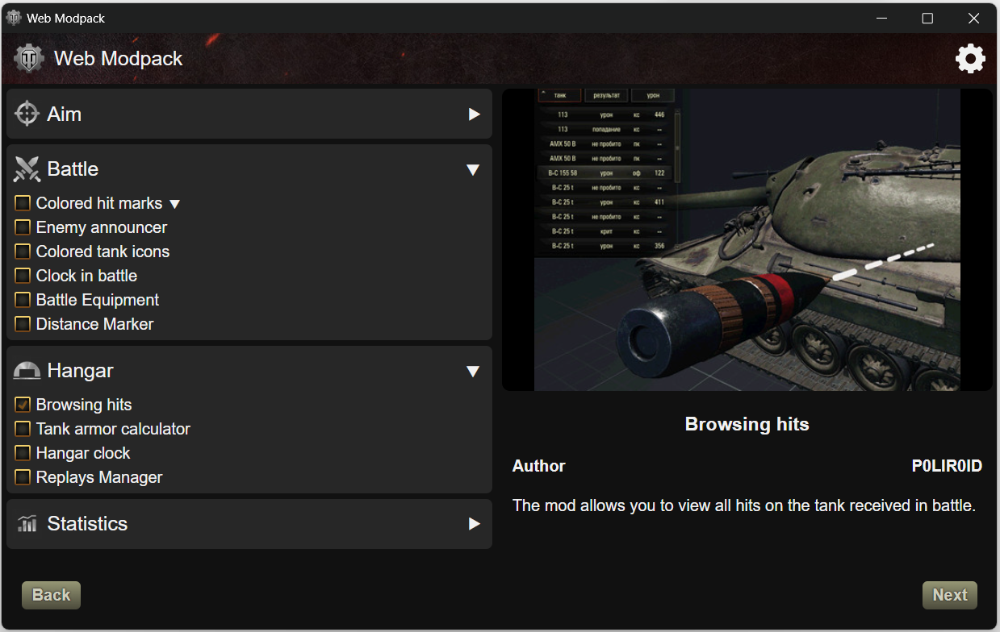
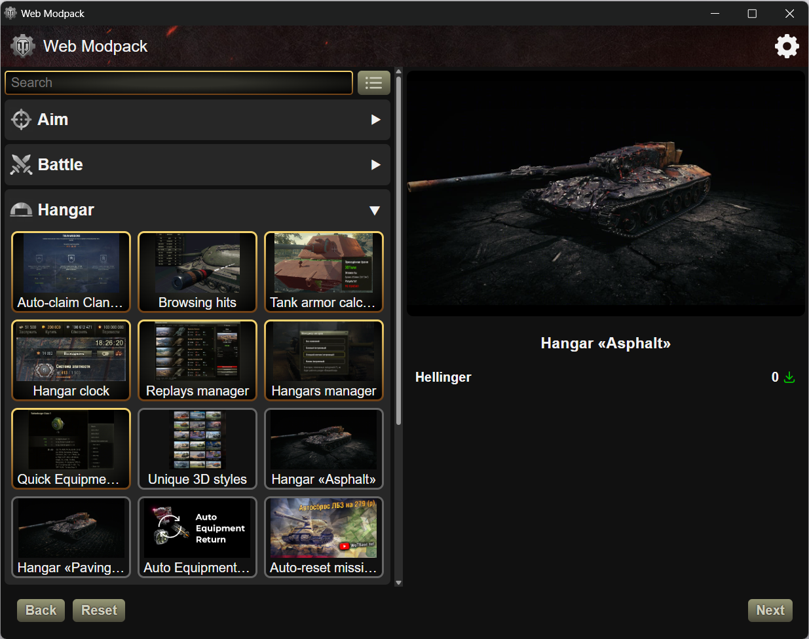

# Web Modpack
### Lightweight and modern modpack for World of Tanks

    
    
    

### <a href="https://github.com/SuperZombi/wot-modpack/releases/latest/download/Web.Modpack.exe"> Download</a>

The problem of all modpacks is their large size. 
This modpack downloads only those mods that the user selected at runtime. 
Also it has a modern Web interface. 
Supports all client versions (including CT and SB)

> [!WARNING]  
> For the first installation, it is recommended to check the «Delete mod configs» option to avoid conflicts with previous modpacks.

> [!NOTE]  
> Modpack version does **NOT** necessarily have to match the client version!

### [Mods List](https://superzombi.github.io/wot-modpack/)

 

  
<b>More Images</b>

  
  

## Data Collection Notice

This modpack automatically collects **anonymous statistics** that includes:
- List of selected mods.
- Modpack version.
- WoT version.
- Client type (Steam or WGC).
- Client language.

The collected data is used **only for ranking mods by popularity**!
- **No personal data** (such as username, IP address, or system information).   

By using this modpack, you agree to this data collection.

### <a href="https://github.com/SuperZombi/wot-modpack/issues/new?template=1-mod-suggestion.yml"> Request a new Mod</a>

### <a href="https://github.com/SuperZombi/wot-modpack/issues/new?template=3-bug-report.yml"> Report a Bug</a>

#### 💲Donate
<table>
  <tr>
    <td>
       
    </td>
    <td>
      <a href="https://donatello.to/super_zombi">Donatello</a>
    </td>
  </tr>
  <tr>
    <td>
       
    </td>
    <td>
      <a href="https://www.donationalerts.com/r/super_zombi">Donation Alerts</a>
    </td>
  </tr>
</table>
